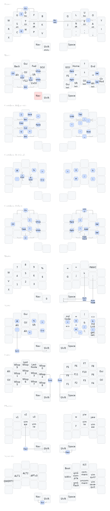
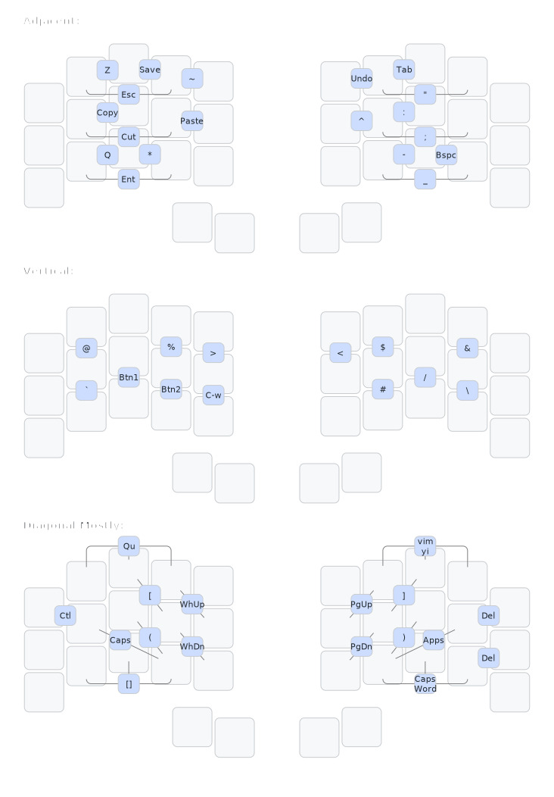

# the possumvibes keymap, or the tale of "What If There Was Caps-Word But For Numbers?"

## the possumvibes layout: an overview
A (QMK) featureset designed around holding keys down as little as possible, keeping finger use balanced across all layers, and reducing fast and/or repetitive thumb movement as much as possible. This layout leverages combos, home row mods, smart layers, one- and two-shot (*n*-shot, to be specific) mods, and locking mods to reduce the number of held keys across the board. In fact, there's only one!

### Design Principles
- Hand and finger balance. 
- Tap-focused rather than hold-focused.
- Balanced (minimal) thumb load.
- Fast access to commonly needed symbols and operations.

...which all sums up neatly into a layout fine-tuned to benefit my combination of hypermobility and RSI!

## The Keys
Every layer and mod key pictured is a sticky/one-shot unless labeled otherwise :D

Layer accesses are highlighted in red on each layer. All but two total are combos, and most of those are same-hand thumb-finger combos. Most layers have multiple access points.

The base alpha layout is [APTv3](https://github.com/Apsu/APT) with several keys removed because my hands don't like to bend that way. This first visualization is just my actual keymap layers, and so it's missing a lot of keys. Over 50 of them, in fact, all available on every layer! I have a separate combos-only visualization after this one. (I am also still figuring out the most sensible way to show all these layers and combos.)

Visualizations made with [keymap-drawer](https://github.com/caksoylar/keymap-drawer)

## The Alphas
My alpha layout is APTv3, linked in the Sources section, and I've been using it since January 2022. It is straight up the most comfortable layout I have ever used. The combination of reduced inner index and overall comfortable handshapes makes for a really comfy layout that also plays nicely with the ways my hands like to injure themselves. (also RSTH homerow best homerow) 

A significant number of my convenience macros are designed to prevent having to track keys down for shortcuts with a non-QWERTY layout. As a result, there are no alpha-layout-specific features or expected inputs in the overall keymap. 

I use inverted-T tap-hold mods on base for shortcuts and navigation. These are the primary holds on the board, and I have alternate options.

I use a dedicated one-shot thumb key shift so I never have to hold shift down.

**Don't worry if the alpha layout isn't what you like!** I use APTv3 with a reduced amount of characters because of my hands' needs. This is a living document of the overall keymap that works for me, and the alpha layout that works for my hands may not be the right one for yours. My hope with this doc is to present ideas around RSI/hypermobility-friendly layout design that I haven't seen elsewhere and were the critical pieces that have kept me able to work at a keyboard.

## The Features

### N-shot mods
I have rolled my own QMK oneshot/sticky mods, based on the Callum userspace implementation, but with the twist of being able to specify how many keypresses the mod should be active for. Thus, *n*-shot mods rather than one-shots! I use this primarily for a two-shot Ctrl key, which is very useful when working with many multi-key shortcuts! Keys to be ignored toward the n-shot count and keys to clear the n-shot mod are defined once and apply to all defined mods like in the original Callum implementation. 

All dedicated mod keys on my keymap are n-shots unless specified otherwise.

**QMK Specifics**
This implementation solves the issue of shifting extra characters when rolling present in the base Callum implementation. It also makes the ability to roll _into_ the mod customizable. When held for longer than TAPPING_TERM without another keypress, the mod will act as a normal held mod and release without queueing.

I use an n-shot shift as my thumbshift to allow me to create functionally order-agnostic layer and mod activation (e.g., Shift Num nets me Num layer with Shift queued). If you're considering using these n-shots and don't have that requirement, *use the qmk default OSM for thumbshift instead*. 

### Smart Layers
Smart layers are, functionally, caps word but for your layer of choice, with cancel keys defined. As an example, I have NumMode and FuncMode, each of which allow me to keep typing numbers or f-keys respectively until I hit a cancel key. I access these by combo and use the combination (eyyy) of features to eliminate held layer keys. My original implementation is adapted from the T-34 layout, linked in the code influences section, and has since been expanded to cover nearly all my layers. 

Another neat feature of the smart layer implementation is the ability to make a "oneshot" layer that allows mods to be activated before or after the layer is toggled. I am leveraging this on my SYM layer, which uses shift overrides for a bunch of macros, and allows me to tap layer and mods in any order (eg, Symmode OS-Shift Paren gives the same result as OS-Shift Symmode Paren). This makes it a lot easier for me to leverage the layer without thumb-shift redirects.

### Locking Mods
Similarly, the "locking" toggle-able mods to allow repeated mod+arrow movement without actually having to hold any mods! Like the smart layers, they have a continue list and a cancel list. I use these exclusively on the Nav layer.

### Combos
Finally, the combos! They are the lifeblood of this layout! At time of writing there are *57* of them, and I use all of them daily. The bulk of the combos are located within the ring-middle-index 3x3 square to fit into comfortable handshapes. Accordingly, the visualization below is split out positionally so everything is actually visible!

The general gist of things I use combos for:

- Layers! All but one of my layers are accessed via combos between same-hand finger and thumb.
- The missing standard 3x5 keys (`q z ; /`)
- Operations Keys (Backspace, Enter, Tab)
- Symbols (`/ * ( ) $`)
- Operations macros (Copy, Caps, Save, Undo)
- Convenience macros (`Qu`, App Launcher )
- and more! 

I also override the shifts on most combos to eliminate extra presses, like doubling commonly repeated symbols, auto-closing parenthesis, or changing the text of a string (for the vimmers out there, I've got a `yi` combo that shifts to `ya` to save me hitting Y).

The combo visuals will say more than I can (and the combos can be read in full in my keymap, linked in the Sources section, or read in shorthand in the [keymap-drawer.yaml](./keymap-drawer/possum_3x5_2.yaml)).

### Sources
[My QMK Userspace](https://github.com/possumvibes/qmk_firmware/tree/possumdev/users/possumvibes), branch `possumdev`, where everything above is coded (my README there has more history and a how-to-navigate-the-userspace guide)

[APTv3 Keyboard Layout](https://github.com/Apsu/APT) - My current alpha layout

[Figma layout design source](https://github.com/bredfield/zmk-config) - all the pretty design templating in my layout is lifted *directly* from the Layout.fig in this repo. Feel free to do the same with mine!

### Code Influences (alphabetically and non-comprehensively)
- Callum's [QMK userspace](https://github.com/qmk/qmk_firmware/tree/master/users/callum) - Oneshots, swappers
- Drashna's [QMK userspace](https://github.com/qmk/qmk_firmware/tree/master/users/drashna) - Wrappers, layout override functions, and a whole lot more
- Jonas H's [T34 layout](https://www.jonashietala.se/blog/2021/06/03/the-t-34-keyboard-layout/) - Numword
- Manna-Harbour's [Miryoku layout](https://github.com/manna-harbour/miryoku) - The actual starting point of this layout, many iterations ago
- Patrick Getreuer's [QMK articles](https://getreuer.info/posts/keyboards/index.html) (aka How I Learned To Stop Worrying And Love Arrays)
- and a whole bunch of discord servers for some hella cool alpha layouts, keymap ideas, and different ways of approaching layout balance at the layer and layout levels. Particular shoutout to the Absolem Club and QMK servers!

### Tools!
- Visualizations made with [keymap-drawer](https://github.com/caksoylar/keymap-drawer)
- QMK for the keymap (and ZMK is getting closer to feature-compatible!)
- and vim for everything else!
