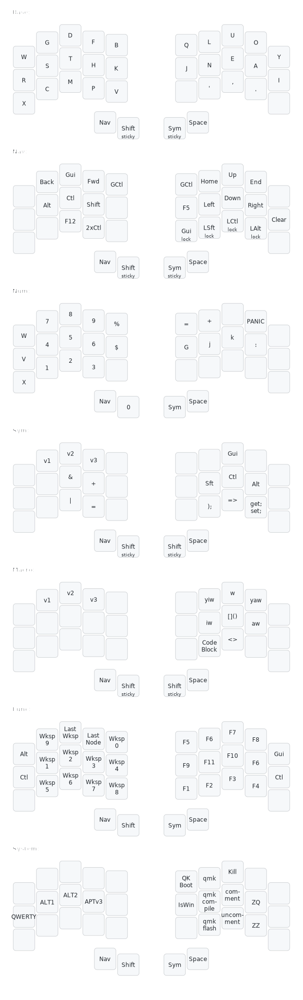

# the possumvibes keymap

## The possumvibes layout: an overview
A (QMK) featureset designed around holding keys down as little as possible, keeping finger use balanced across all layers, and reducing fast and/or repetitive thumb movement as much as possible. This layout leverages combos, home row mods, smart layers, one- and two-shot (*n*-shot, to be specific) mods, locking mods, and one-tap swappers to reduce the number of layer tap-holds needed. 

The layout itself is defined per keyboard, but the core 3x5+2 layout is defined in blocks of five keys using Drashna's wrappers approach. My comfortable range of motion on MX boards is two thumb keys per side, and I'm far more comfortable using thumbs for taps (including thumb-only combos) than holding thumbs. Nav, on my left home thumb, is my only thumb tap-hold, and all other layers are accessed via combo, direct toggle, or alpha LT.

### Locking Mods
These are "locking" toggle-able mods with a defined cancel/continue key list. I use these on my nav layer, specifically for hands-off text editing in cases where I'd otherwise need to keep a mod held (e.g., to select text with Ctrl+Shift+arrow, I can tap into my nav layer, tap locking Ctrl and Shift, and then tap or hold the arrow as long as needed.) My usage of them is very narrow--anything besides the navigation keys (arrows, home, end) and the locking mods themselves will reset the toggled mods.

### N-shot mods
These are an adaptation of the Callum oneshot mods that use array structure and leave the mod "sticky" for a specified *n* amount of keypresses (practically speaking, this means one-shot mods plus a two-shot Ctrl.) N-shots leverage mod bits rather than mod keycodes to allow for multi-mod n-shots (e.g., Gui+Ctrl). Like the Callum implementation, "ignore" and "cancel" keys are defined in separate functions. 

This implementation solves the issue of shifting extra characters when rolling present in the base Callum implementation. It also makes the ability to roll _into_ the mod customizable. When held for longer than TAPPING_TERM without another keypress, the mod will act as a normal held mod and release without queueing.

I currently use nshots on alpha as my thumb one-shot shift, in combos for ease of window management, and on my nav layer, which is accessible from any layer, for use on my non-alpha layers. I use a combination of home row mods, thumb shift, combos, and n-shots on a layer for my mods to allow me multiple ways of activating my most commonly used mods. 

Of note: if not using an n-shot on thumb in combination with smart layers for order-agnostic layer+mod activation, *use the default OSM for thumbshift instead*.

### Smart Layers
Smart layers are, functionally, caps word but for your layer of choice, with cancel keys defined. I have NumMode and FuncMode, each of which allow me to keep typing numbers or f-keys respectively until I hit a cancel key. These are likewise born out of a passionate dislike of holding layer toggles or using thumbs for any kind of fast or repeated movement (*especially* involving holding layer toggles). These are very much inspired by the T-34 layout, linked in the code influences section.

Another neat feature of the smart layer implementation is the ability to make a "oneshot" layer that allows mods to be activated before or after the layer is toggled. I am leveraging this on my SYM layer, which uses shift overrides for a bunch of macros, and allows me to tap layer and mods in any order (eg, Symmode OS-Shift Paren gives the same result as OS-Shift Symmode Paren). This makes it a lot easier for me to leverage the layer without thumb-shift redirects.

### Combos
I use combos very heavily for punctuation and shortcuts. I have enter on the bottom row and tab, esc, and macros on the top row. Home row horizontal combos include cut-copy-paste; home row diagonal with outer thumb activate layer modes. Extra punctuation is primarily on home row, but there are a few characters on home and top as well. Mouse keys are on left hand vertical combos, and more layer access combos are on thumb keys (vertical combo with QWERTY B/N on flat boards, horizontal combo on boards with lowered thumb clusters). As I've reduced down to 34-35 keys, I've added more cross-row combos for things like CapsLock+Word and per-OS app finder. Recent changes emphasize reduced rolling and typo'd activations.

### Sources
[My QMK Userspace](https://github.com/possumvibes/qmk_firmware/tree/possumdev/users/possumvibes), branch `possumdev`, where everything above is coded (my README there has more history and a how-to-navigate-the-userspace guide)

[APTv3 Keyboard Layout](https://github.com/Apsu/APT) - My current alpha layout

[Figma layout design source](https://github.com/bredfield/zmk-config) - all the pretty design templating in my layout is lifted *directly* from the Layout.fig in this repo. Feel free to do the same with mine!

### Code Influences (alphabetically and non-comprehensively)
- Callum's [QMK userspace](https://github.com/qmk/qmk_firmware/tree/master/users/callum) - Oneshots, swappers
- Drashna's [QMK userspace](https://github.com/qmk/qmk_firmware/tree/master/users/drashna) - Wrappers, layout override functions, and a whole lot more
- Jonas H's [T34 layout](https://www.jonashietala.se/blog/2021/06/03/the-t-34-keyboard-layout/) - Numword
- Manna-Harbour's [Miryoku layout](https://github.com/manna-harbour/miryoku) - The actual starting point of this layout, many iterations ago
- Patrick Getreuer's [QMK articles](https://getreuer.info/posts/keyboards/index.html) (aka How I Learned To Stop Worrying And Love Arrays)
- and a whole bunch of discord servers for some hella cool alpha layouts, keymap ideas, and different ways of approaching layout balance at the layer and layout levels. Particular shoutout to the Absolem Club and QMK servers!
