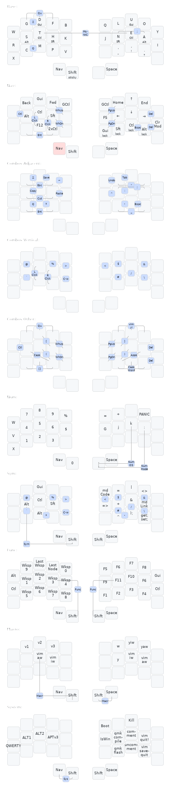
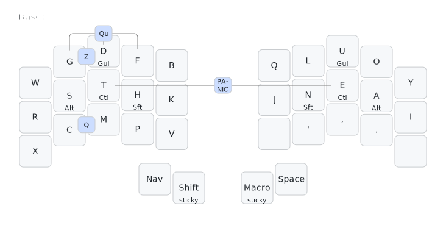
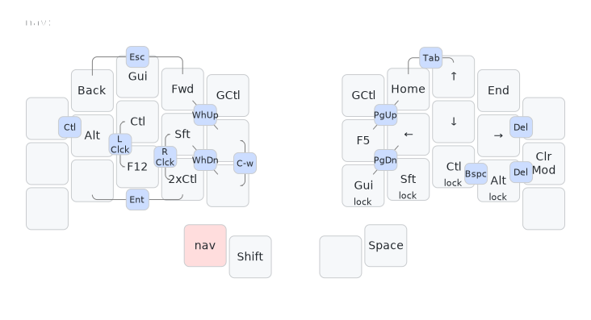
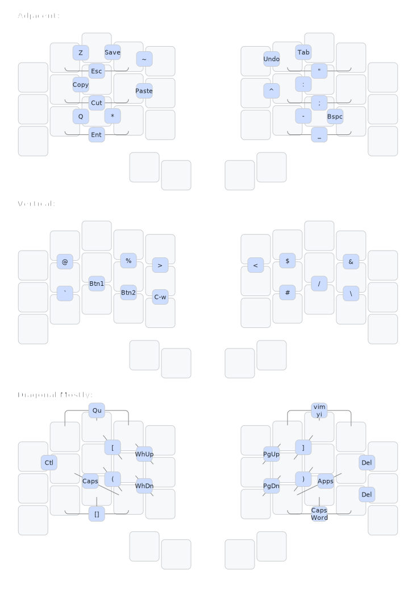

# the possumvibes keymap

Here exists a visualization and explanation of ~~what the hell is happening on my keymap~~ my combo-first, 31-ish key layout!

Bird's eye view:
- 31-ish keys (from a 34-key base)
- Combo-first approach for minimal held keys, including layer toggles
- "Smart" layers, or layer toggles that exit the layer automatically on particular keypress
- Sticky/One-shot mods (including a two-shot sticky mod!)
- Lots of macros and custom shifted behaviors to reduce extra keypresses
- An alternate layout that works comfortably for my hands ([APTv3](https://github.com/Apsu/APT))

I (the aforementioned possumvibes) have hypermobile joints that *really* like to overextend on the keyboard, and repetitive strain injury in my thumbs. I use small, low-profile split keyboards to reduce hand movement overall, and I use this layout on those boards to reduce joint strain and pressure (and it's comfy!).

## the images
(Coming soon: images broken out by layer-grouping. for now there is one giant image. good luck.)

Every layer and mod key pictured is a sticky/one-shot unless labeled otherwise :D

Visualizations made with [keymap-drawer](https://github.com/caksoylar/keymap-drawer)

## Base: APTv3

### Keys: There's fewer of 'em.
I use [APTv3](https://github.com/Apsu/APT). I like the fast rolls, the reduced inner index, and the overall handshapes (and more, but the alphas aren't actually the main point of the layout! They're just the starting point. There's weirder stuff on this layer alone.

I have a reduced range of motion in my right index and pinky (well, sort of. *Technically* I actually have an *extremely wide* range of motion in these fingers, with strong likelihood of my joints trying to exit their sockets. I try to discourage that kind of shenanigan). On the right hand, it's painful for me to reach upper and lower lateral index and it's a strain to press lower pinky. I have removed these three keys from my layout and moved the things that used to be there (Q, Z, ;) to combos.

### COMBOS: WE GOT 'EM.
As mentioned, I've got `Q` and `Z` on combos. I also have `Qu` as a convenience combo, and I find I use it much more frequently than `q` alone. But! Remember how I described this layout as "combo-heavy"? Well, I have 57 combos at the time of writing and they are all accessible on all layers. Even my layers are nearly all accessed by combo! These will be split among the images for readability's sake, but every combo pictured is indeed available on Base and every other layer. 

### Thumbs
My thumbs have a fun double-whammy of RSI and easy overextension. I've found reducing overall burden and eliminating held keys as much as possible to be the best approach. Accordingly, Nav is the only held layer in my layout, because I use it for variable lengths every time. That key is also a tap-toggle for the layer, though, so I can reduce holds even so. My left hand reachy is sticky Shift, and I find I home between those two keys. On the right hand, I home on Space. This hand is *really* sensitive to strain, so my reachy key has been a no-op for some time and now is *very tentatively* a sticky Macro-layer. I use adjacent thumb combos and reachy thumb+same-hand alpha combos for layer access (pictured by layer).

### Mods
I use inverted-T mods (home-row mods, but make it WASD instead of HJKL) for fast shortcuts. I have fairly low tapping terms on these and use them near-exclusively for mod combinations on shortcuts--I do not use my home row Shift to shift text. I use my thumbshift for that instead! Held keys like these are very stressful on my joints, so I have both home row mods and sticky mods on layers. Overall, it is far less stressful for my joints to manage Alt, Ctrl, and Gui as tap-hold mods and Shift as a tap on thumb. I also leverage Caps Word and Caps Lock to reduce the amount of Shift usage. The most important thing for my hands is having options that I can shift (pun intended) toward when one method is causing overwork.

 

## Nav

### Keys
Nav is accessed via home thumb layer tap, and the layer handles as little as possible to reduce the amount of thumb-holds. There's very little outside the scope of arrows, navigation keys, and mods--F5 is both refresh and my debugging "continue" key; F12 is the Visual Studio "Go to definition/go to implementation" key, and just about everything else is mods.

### Mods
This layer has three kinds of mods on it! First, sticky inverted-T mods, for use on the layer and on any other. Second, a sticky *two-shot* Ctrl key for two-character shortcuts (again, Visual Studio, though it's useful in other circumstances!). Last, "locking" toggle-able mods for use with the arrows! The "locking" mods allow me to avoid holding mods with arrows, like when using mod+arrow-based multi-line editing. Nowadays, I primarily use it for resizing windows in my window manager, but having those on hand is great to reduce stress on my hand. All three of these types of mods are custom in [my QMK userspace](https://github.com/possumvibes/qmk_firmware/tree/possumdev/users/possumvibes).

 

## Num
todo: image.
### Keys
### Features

 

## Sym
todo: image.
### Keys
### Features

 

## Func
todo: image.
### Keys
### Features

 

## Macro
todo: image.
### Keys
### Features

 

## System
todo: image.
### Keys
### Features

# probably delete this
### Smart Layers
Smart layers are, functionally, caps word but for your layer of choice, with cancel keys defined. As an example, I have NumMode and FuncMode, each of which allow me to keep typing numbers or f-keys respectively until I hit a cancel key. I access these by combo and use the combination (eyyy) of features to eliminate held layer keys. My original implementation is adapted from the T-34 layout, linked in the code influences section, and has since been expanded to cover nearly all my layers. 

Another neat feature of the smart layer implementation is the ability to make a "oneshot" layer that allows mods to be activated before or after the layer is toggled. I am leveraging this on my SYM layer, which uses shift overrides for a bunch of macros, and allows me to tap layer and mods in any order (eg, Symmode OS-Shift Paren gives the same result as OS-Shift Symmode Paren). This makes it a lot easier for me to leverage the layer without thumb-shift redirects.

### Locking Mods
Similarly, the "locking" toggle-able mods to allow repeated mod+arrow movement without actually having to hold any mods! Like the smart layers, they have a continue list and a cancel list. I use these exclusively on the Nav layer.

### Combos
Finally, the combos! They are the lifeblood of this layout! At time of writing there are *57* of them, and I use all of them daily. The bulk of the combos are located within the ring-middle-index 3x3 square to fit into comfortable handshapes. Accordingly, the visualization below is split out positionally so everything is actually visible!

The general gist of things I use combos for:

- Layers! All but one of my layers are accessed via combos between same-hand finger and thumb.
- The missing standard 3x5 keys (`q z ; /`)
- Operations Keys (Backspace, Enter, Tab)
- Symbols (`/ * ( ) $`)
- Operations macros (Copy, Caps, Save, Undo)
- Convenience macros (`Qu`, App Launcher )
- and more! 

I also override the shifts on most combos to eliminate extra presses, like doubling commonly repeated symbols, auto-closing parenthesis, or changing the text of a string (for the vimmers out there, I've got a `yi` combo that shifts to `ya` to save me hitting Y).

The combo visuals will say more than I can (and the combos can be read in full in my keymap, linked in the Sources section, or read in shorthand in the [keymap-drawer.yaml](./keymap-drawer/possum_3x5_2.yaml)).

### Sources
[My QMK Userspace](https://github.com/possumvibes/qmk_firmware/tree/possumdev/users/possumvibes), branch `possumdev`, where everything above is coded (my README there has more history and a how-to-navigate-the-userspace guide)

[APTv3 Keyboard Layout](https://github.com/Apsu/APT) - My current alpha layout

[Figma layout design source](https://github.com/bredfield/zmk-config) - all the pretty design templating in my layout is lifted *directly* from the Layout.fig in this repo. Feel free to do the same with mine!

### Code Influences (alphabetically and non-comprehensively)
- Callum's [QMK userspace](https://github.com/qmk/qmk_firmware/tree/master/users/callum) - Oneshots, swappers
- Drashna's [QMK userspace](https://github.com/qmk/qmk_firmware/tree/master/users/drashna) - Wrappers, layout override functions, and a whole lot more
- Jonas H's [T34 layout](https://www.jonashietala.se/blog/2021/06/03/the-t-34-keyboard-layout/) - Numword
- Manna-Harbour's [Miryoku layout](https://github.com/manna-harbour/miryoku) - The actual starting point of this layout, many iterations ago
- Patrick Getreuer's [QMK articles](https://getreuer.info/posts/keyboards/index.html) (aka How I Learned To Stop Worrying And Love Arrays)
- and a whole bunch of discord servers for some hella cool alpha layouts, keymap ideas, and different ways of approaching layout balance at the layer and layout levels. Particular shoutout to the Absolem Club and QMK servers!

### Tools!
- Visualizations made with [keymap-drawer](https://github.com/caksoylar/keymap-drawer)
- QMK for the keymap (and ZMK is getting closer to feature-compatible!)
- and vim for everything else!
