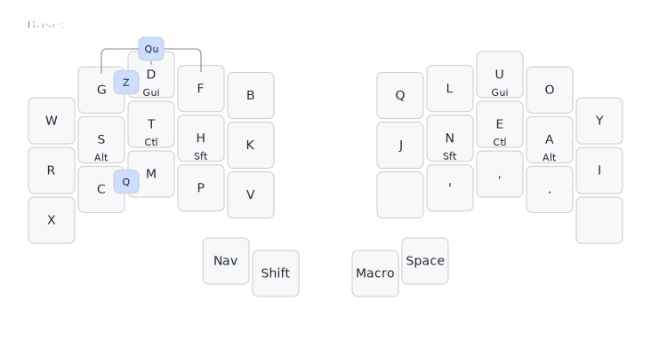
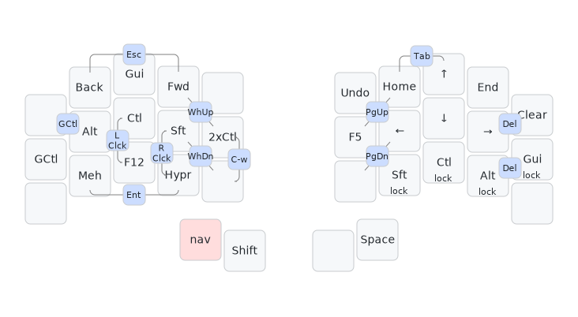
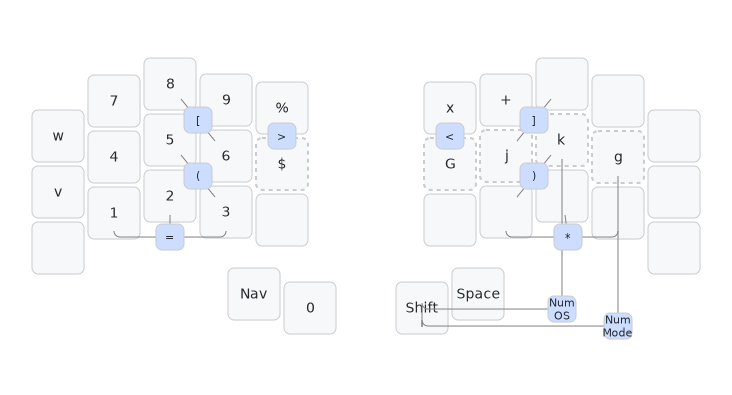
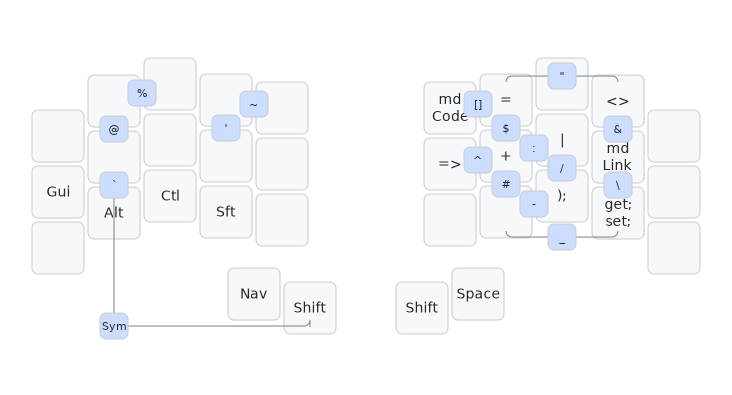
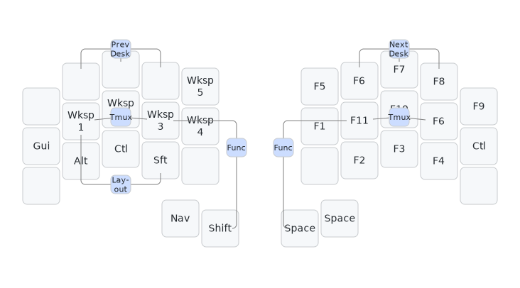
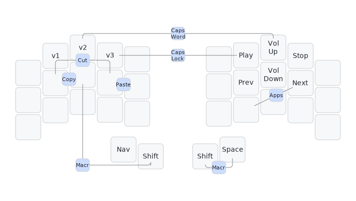
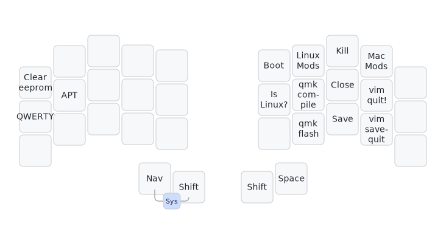

# the possumvibes keymap

Here exists a visualization and explanation of ~~what the hell is happening on my keymap~~ my combo-first, 31-ish key layout!

Bird's eye view:
- 31-ish keys (from a 34-key base)
- Combo-first approach for minimal held keys, including layer toggles
- "Smart" layers, or layer toggles that exit the layer automatically on particular keypress
- Sticky/One-shot mods (including a two-shot sticky mod!)
- Lots of macros and custom shifted behaviors to reduce extra keypresses
- An alternate layout that works comfortably for my hands ([APTv3](https://github.com/Apsu/APT))

I (the aforementioned possumvibes) have hypermobile joints that *really* like to overextend on the keyboard, and repetitive strain injury in my thumbs. I use small, low-profile split keyboards to reduce hand movement overall, and I use this layout on those boards to reduce joint strain and pressure (and it's comfy!).

## layout link
[My QMK Userspace](https://github.com/possumvibes/qmk_userspace/tree/possumdev/users/possumvibes), branch `possumdev`, where everything above is coded (my README there has more history and a how-to-navigate-the-userspace guide)

## the images
Every layer and mod key pictured is a sticky/one-shot unless labeled otherwise :D

Visualizations made with [keymap-drawer](https://github.com/caksoylar/keymap-drawer)

## Base: APTv5

### Keys: There's fewer of 'em.
I use APTv5, an unofficial iteration of [APTv3](https://github.com/Apsu/APT). I like the fast rolls, the reduced inner index, and the overall handshapes (and more, but the alphas aren't actually the main point of the layout! They're just the starting point. There's weirder stuff on this layer alone.

I have a reduced range of motion in my right index and pinky (well, sort of. *Technically* I actually have an *extremely wide* range of motion in these fingers, with strong likelihood of my joints trying to exit their sockets. I try to discourage that kind of shenanigan). On the right hand, it's painful for me to reach lower lateral index or lower pinky. I've discovered that using 32 keys, cutting out bottom pinky and lateral index on both hands, is my most comfortable range of motion. I've offloaded the lowest-frequency alphas to combos, as well as the symbols that would otherwise land on the keys I've removed, and the reduced motion and minimal lateral reaches are *so much better* for my hands.

### COMBOS: WE GOT 'EM.
As mentioned, I've got `Q` and `Z` on combos. I also have `'`, `;`, and `/` of the standard base layer punctuation as combos. But! Remember how I described this layout as "combo-heavy"? Well, I have ~~57~~ *61* combos at the time of writing and they are all accessible on all layers. Even my layers are nearly all accessed by combo! These will be split among the images for readability's sake, but every combo pictured is indeed available on Base and every other layer.

The most noteworthy combo visible on this layer is PANIC! My layout has a lot of state and a lot of combos, and it's very possible for me to end up on layers and in weird states without realizing it. PANIC is designed to rescue me. It moves back to the default layer, clears any active modifiers, and clears Caps Word and Caps Lock state. I also use this key to manually exit stateful layers. 

### Thumbs
My thumbs have a fun double-whammy of RSI and easy overextension. I've found reducing overall burden and eliminating held keys as much as possible to be the best approach. Accordingly, Nav is the only held layer in my layout, because I use it for variable lengths every time. That key is also a tap-toggle for the layer, though, so I can reduce holds even so. My left hand reachy is sticky Shift, and I find I home between those two keys. On the right hand, I home on (tucky) Space. This hand is *really* sensitive to strain, so my reachy thumb (Also Space) serves as my leader key, the root of my layer entry combos, and, on left-hand activated layers, my oneshot shift key. My right thumb does very little beside spacing in rapid movement, and extension is exclusively in flow-breaking movements. Could not begin to explain why that setup works so well for my thumb, but I'm just glad to know that it does!

### Mods
I use inverted-T mods (home-row mods, but make it WASD instead of HJKL) for fast shortcuts. I have fairly low tapping terms on these and use them near-exclusively for mod combinations on shortcuts--I do not use my home row Shift to shift text. I use my thumbshift for that instead! Held keys like these are very stressful on my joints, so I have both home row mods and sticky mods on layers. Overall, it is far less stressful for my joints to manage Alt, Ctrl, and Gui as tap-hold mods and Shift as a tap on thumb. I also leverage Caps Word and Caps Lock to reduce the amount of Shift usage. The most important thing for my hands is having options that I can shift (pun intended) toward when one method is causing overwork.

 

## Nav

### Keys
Nav is accessed via home thumb layer tap, and the layer handles as little as possible to reduce the amount of thumb-holds. There's very little outside the scope of arrows, navigation keys, and mods--F5 is both refresh and my debugging "continue" key; F12 is the Visual Studio "Go to definition/go to implementation" key, and just about everything else is mods.

### Mods
This layer has three kinds of mods on it! First, sticky inverted-T mods, for use on the layer and on any other. Second, a sticky *two-shot* Ctrl key for two-character shortcuts (again, Visual Studio, though it's useful in other circumstances!). Last, "locking" toggle-able mods for use with the arrows! The "locking" mods allow me to avoid holding mods with arrows, like when using mod+arrow-based multi-line editing. Nowadays, I primarily use it for resizing windows in my window manager, but having those on hand is great to reduce stress on my hand. All three of these types of mods are custom in [my QMK userspace](https://github.com/possumvibes/qmk_firmware/tree/possumdev/users/possumvibes).

 

## Num

This layer has--you guessed it--numbers!

### Caps Word For Numbers????
The primary access switch for this layer is a smart toggle! Num-mode toggles on the layer and toggles it off after certain characters, like space. This allows me to type numbers without having to hold a layer for variable length. If I'm writing `That cost 10 bucks`, I'll tap `That cost <NUMMODE>10 bucks`, and the layer automatically turns off after the space. `j`, `k`, and `G` are for vim movements (go 10 lines up/down) and exit the layer, `v` and `x` are for things like `v4` and `2x4` and continue it. Keys that exit the layer have dotted outlines.

The OS Num combo for the layer is a simple oneshot/sticky layer, for occasions when I need to write a single number within a larger alphanumeric word and won't have a NumModeexit case after it: `(b^2 -4ac)/2a`.

I use my PANIC key a lot on this layer when I need to intersperse numbers in text that's not staged as exit keys on the later, like when typing out a guid. I categorically do not recommend typing out guids on account of "ughhhhhh".

 

## Sym

### Keys
The bulk of my combos are symbols, and so my actual sym layer is very light, pretty much just `= + | &` and macros for C# or Markdown.

This layer has been one of the biggest issues for my hands/wrists. Sym is a high-traffic layer for a software engineer, and I found that pretty much no matter how I had the layer arranged, the number of times I'd have to hit my layer access, whatever it was, would create joint strain and exacerbate my RSI. My biggest gamechanger was getting parenthesis and brackets onto base, and from there, it became a process of identifying when a key on the layer was uncomfortable, figuring out a combo for it, rinse and repeat.

The non-bracket symbols are placed by how frequently I use them in prose, code, or modal editing ([kakoune](https://kakoune.org/) or vim), and also a little bit just by vibes. This layer and combos change the most of anything on my layout, so it's a fair bet that the image is out of date at almost any time of viewing, but the general principle stays the same!

### Features
I have shift overrides on nearly all my symbols to add custom functionality that would otherwise take more than just an extra tap to accomplish. Most of my symbols double when shifted (e.g., Shift `+` sends `++`). Some of my symbols pair and move the cursor back (e.g., Shift `(` sends `(|)`, where `|` is the cursor position, and Shift backtick sends`` `|` ``). The shift macros save me keystrokes and layer entries, and I use them constantly.

Mods on this layer are my standard n-shots. (This is the default mod on every layer with mods--Nav is just special.)

 

## Func

### Keys
This layer serves as my function layer on the right hand and my window management layer on the left. Entry is mirrored on both sides.

Function keys are arrayed in a mostly-numerical order that makes enough sense to me for me to be able to find everything. As a known Visual Studio User, `F11`, `F10`, and `F6` are my default Step-Into, Step-Over, and Rebuild keybindings, so they get top billing in the arrangement.

Window keys give me (OS-specific! see Nav layer) direct shortcuts to swap to that numbered desktop.

 

## Macro

### Keys
This layer nets me a few more macros. It started out as a bandaid for using vim on an alternate layout, but since I've improved my tools (kakoune as my editor; keyboard with pinky splay), I no longer need it for that. Now, it holds my extremely handy `v1-3` combos, which I use *all the damn time* at work and save me so many keypresses. (Yep, the `v` placed on Num is designed to handle the passingly rare `v4`+.) I'm currently testing using it for media keys.

I access the right hand media keys via the left-hand combo access, and the `vN`s via the right-hand thumb combo. My right thumb is the weakest point of my fraught ergonomic truce, so macro left hand is intentionally extremely light. If I have more reason to use the thumb combo, I will, and then my joints and I will regret it, so near-empty layer it is!

### Combos
(As mentioned, all combos are available on all layers. They're presented thematically on layers)

My `Apps` combo launches my application picker. On linux, this launches `rofi`; on Mac this launches Alfred; and on Windows this was a plain `Gui` tap.

I HOLLER A LOT IN CHAT so I leverage both Caps Lock and Caps Word in combos.

 

## System

### Keys
This layer holds a handful of system-handling macros! They fall into three basic categories: Keyboard firmware management, keyboard default state management, and gettin' outta dodge (for cases where "dodge" is "windows and applications"). I access this layer via left thumb combo for speed. Technically, I can hold this combo for held access to the layer, but there is absolutely no reason to ever do that.

For firmware management, there are QMK `compile` and `flash` commands, as well as a key to enter bootloader. I use these to fast-track keyboard iteration, and have my default board and keymap settings in my QMK configuration.

Keyboard Default State management covers my base layout--I usually have an alternate layout on the board. It's also not QWERTY--I just can't be bothered to rename the key! IsLinux sets a bool state of, well, whether or not I'm using Linux at the time. Many macros and mods throughout my layout send different codes depending on whether the board is in Linux state or not, including on this layer!

Gettin' Outta Dodge means closing applications and the ever-important Exiting Vim. Middle and ring columns are logically mirrored--middle for GUI programs, and ring for `vi`-like programs. Homerow covers "close window/client", bottom row covers "save the thing"; for GUI programs only, top middle sends a Kill/Close Program signal. (The GUI commands here send different values depending on IsLinux value.)

### Features
The IsLinux key sets a boolean state value that a significant amount of my keys and macros use to customize behavior per OS. There are a a lot of shortcuts that vary between default Win/Mac bindings and my Linux ones! This generally means extra logic in my keycode handler, but is fairly simple otherwise.

HOWEVER! I recently switched from Windows to Mac at work, and wow, there are significantly fewer commonalities between Mac and my normal Linux keybinds than between Windows and Linux. I now have a funky additional set of logic in the LINMODS and MACMODS keys to handle needing Ctrl in its default position *sometimes* on Mac and Gui in the default Ctrl position the rest of the time. These two keys explicitly toggle a flag that I use to control the alpha layer layer-tap mods separately from the rest of the IsLinux behavior. LINMODS triggers setting the default layer back to the Linux version (with GACS homerow mods), and MACMODS swaps the default layer back to the Mac default (CAGS homerow mods). I have separate keys for each of these states because trying to keep the IsLinux state versus the homerow mods state was a *nightmare*. It's much simpler for me to be able to say "okay, time to swap to Mac state, but I'm going to be in kakoune for the next hour, so I'll set the HRMs to the Ctrl-prioritized variant and swap over when I need to interact with Firefox" and hit the dedicated keys for each of those things.

## Sources

### Code Influences (alphabetically and non-comprehensively)
- Apsu's layouts ([APT](https://github.com/Apsu/APT) linked, but check out all of her posted layouts)
- Callum's [QMK userspace](https://github.com/possumvibes/qmk_userspace/tree/possumdev/users/callum) - Oneshots, swappers
- Drashna's [QMK userspace](https://github.com/drashna/qmk_userspace) - Wrappers, layout override functions, and a whole lot more
- Jonas H's [T-34 layout](https://www.jonashietala.se/blog/2021/06/03/the-t-34-keyboard-layout/) - Numword
- Manna-Harbour's [Miryoku layout](https://github.com/manna-harbour/miryoku) - The actual starting point of this layout, many iterations ago
- and a whole bunch of discord servers for some hella cool alpha layouts, keymap ideas, and different ways of approaching layout balance at the layer and layout levels. Particular shoutout to the Absolem Club and QMK servers!

### Tools!
- Visualizations made with [keymap-drawer](https://github.com/caksoylar/keymap-drawer)
- [QMK](https://docs.qmk.fm/) for the keymap
- and [kakoune](https://kakoune.org/) for everything else!
